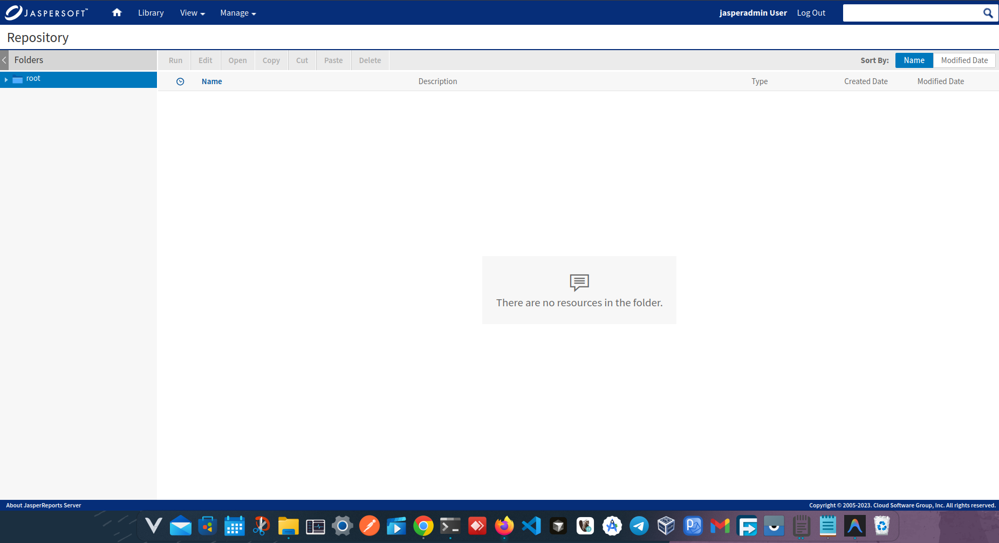
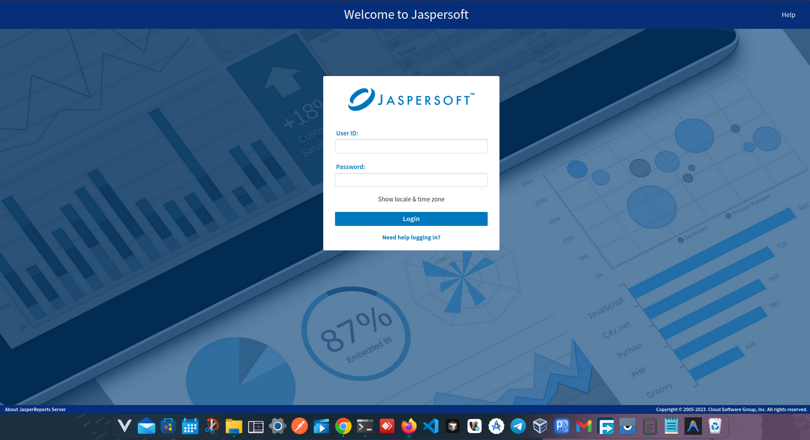

# JasperReports Server Starter




A lightweight, beginner-friendly starter kit to deploy **JasperReports Server** using Docker Compose in just a few minutes. No long documentation, just results!

## Project Overview

This repository provides a ready-to-use `docker-compose.yml` file to spin up JasperReports Server and its required MariaDB database. It is designed for developers who want to test, learn, or run JasperReports Server quickly without the hassle of manual configuration.

## Features

* **One-Command Setup:** Bring up the entire stack with a single Docker command.
* **Pre-configured Database:** Includes a MariaDB container pre-linked to JasperReports.
* **Persistent Storage:** Data and reports are saved safely even if the containers are removed.
* **External Network Support:** Ready to integrate with other environments (like `oracle-adb-network`).
* **Lightweight & Clean:** No unnecessary enterprise jargon or complex build scripts.

## Quick Start

Follow these steps to get your JasperReports Server running instantly.

### Prerequisites

* Docker installed
* Docker Compose installed

### 1. Clone the Repository

```bash
git clone https://github.com/yourusername/jasperreports-server-starter.git
cd jasperreports-server-starter
```

### 2. Create the External Network (Required)
Because this starter kit is designed to easily integrate with other networks (like your Oracle ADB setup), we define an external network. Create it before starting the containers:
```bash
docker network create oracle-adb-network
```

### 3. Start the Server

```bash
docker-compose up -d
```
*Note: The first startup might take a few minutes as it initializes the database and application.*

## Understanding the Docker Compose

The `docker-compose.yml` consists of two main services:

* **`db` (MariaDB):** The backend database where JasperReports stores its configurations, users, and repository metadata.
* **`web` (JasperReports):** The actual application interface. It connects to the `db` service automatically using the provided environment variables.

Both services are configured to restart automatically and use mapped volumes so your data isn't lost when the containers stop.

## Access & Default Credentials

Once the containers are up and running, you can access the server from your browser.

* **URL:** [http://localhost:9091](http://localhost:9091)
* **Username:** `jasperadmin`
* **Password:** `jasperadmin`

## Persistent Storage

This setup uses Docker Volumes to ensure your reports, users, and database records survive container restarts.

* `mariadb_data`: Stores the raw MariaDB database files.
* `jasperreports_data`: Stores JasperReports configurations and customizations.

## Backup and Restore

### To backup your data:
You can safely back up the database that contains all the reports, user configurations, and folder structures.
```bash
docker exec mariadb sh -c 'exec mysqldump --all-databases -uroot -p"$MARIADB_ROOT_PASSWORD"' > backup.sql
```

### To restore your data:
```bash
docker exec -i mariadb sh -c 'exec mysql -uroot -p"$MARIADB_ROOT_PASSWORD"' < backup.sql
```

## Common Issues and Fixes

**1. Network `oracle-adb-network` declared as external, but could not be found**
* **Fix:** Run `docker network create oracle-adb-network` before running `docker-compose up -d`.

**2. The JasperReports page shows "Connection Refused" or doesn't load**
* **Fix:** JasperReports requires a few minutes to fully start up Tomcat and initialize the database. Check the logs with `docker logs -f jasperreports` and wait until you see the Tomcat server started message.

**3. Port 9091 is already in use**
* **Fix:** Edit the `docker-compose.yml` file and change the port mapping `"9091:8080"` to another available port, like `"9092:8080"`.

## Repository Structure

```text
jasperreports-server-starter/
├── docker-compose.yml               # The core configuration file
├── README.md                        # This documentation
├── LICENSE                          # MIT License
└── start_jasper_report_server.png   # Dashboard screenshot
```


## License

This project is licensed under the [MIT License](LICENSE).
